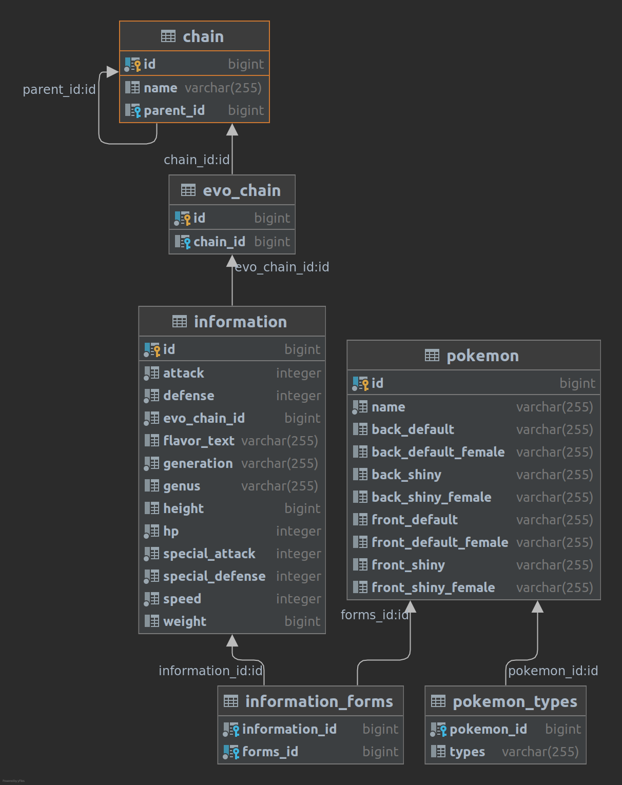

# Pokenac - Backend

## About 

Pokenac is a RESTful API, its structure was based on PokeAPI using the MVC design pattern.

## Structure

Data were filtered from the PokeAPI and the tables were built in a way to facilitate the storage and visualization of information.

## Data

Data can be accessed in the following ways:

1. Pokémon
    - `/api/v1/pokemon`: Get list of all Pokémon.
    - `/api/v1/pokemon/:id`: Get Pokémon by id.
    - `/api/v1/pokemon?page=:pg&limit=:limit`: Pageable list result. Ex: `/api/v1/pokemon?page=0&limit=25`, to get the first 25 pokémon.
    - `/api/v1/pokemon?value=:value`: Search pokémon with name similar to :value.
2. Information
    - `/api/v1/info/:id`: Get Information by pokémon id.
3. Evo Chain
    - `/api/v1/evo/:id`: Get evo chain by id (evo_chain_id is define in pokémon information).
